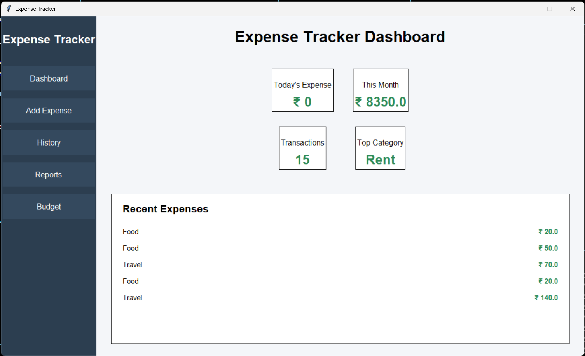
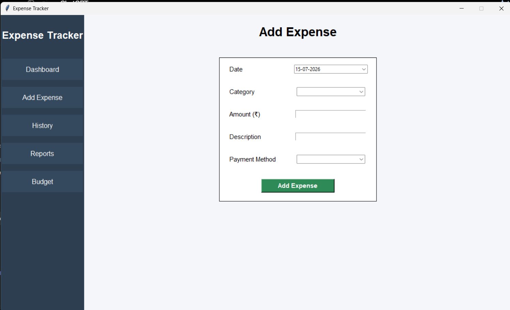
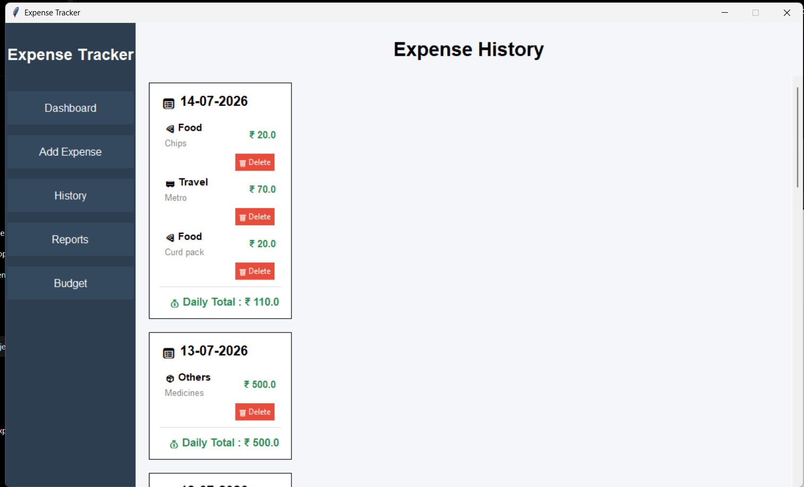
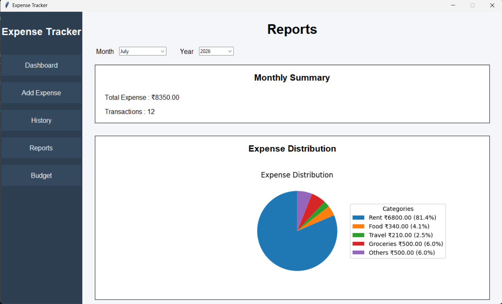
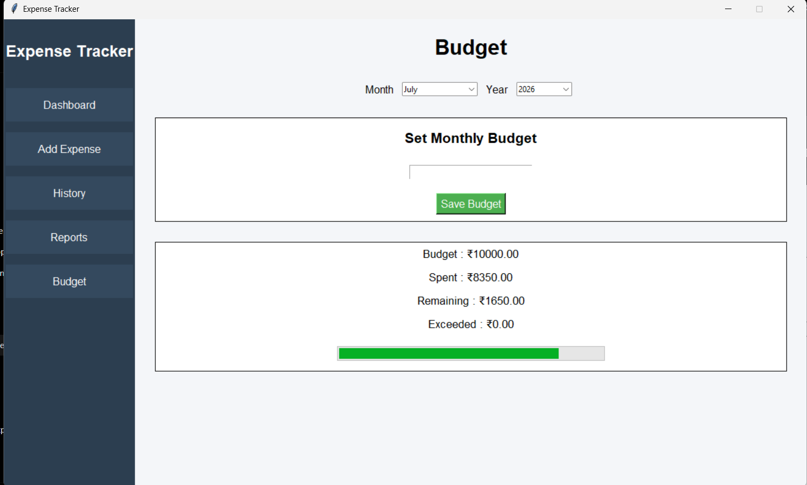

# 💰 Expense Tracker

A desktop-based **Expense Tracker Application** built using **Python, Tkinter, SQLite, and Matplotlib**. The application helps users record daily expenses, manage monthly budgets, analyze spending patterns, and generate monthly reports through an easy-to-use graphical interface.

---

## 📌 Features

### 🏠 Dashboard
- Displays today's total expenses
- Shows monthly total expenses
- Displays total transactions
- Shows top spending category
- Recent expense summary

### ➕ Add Expense
- Add new expenses with:
  - Date
  - Category
  - Amount
  - Description
  - Payment Method
- Input validation for accurate data entry

### 📜 Expense History
- View all expenses
- Expenses grouped by date
- Delete unwanted expenses

### 📊 Reports
- Select Month and Year
- View monthly total expenses
- View total transactions
- Category-wise expense summary
- Interactive Pie Chart for expense distribution

### 💵 Budget Management
- Set monthly budget
- View total expenses
- Track remaining budget
- Monitor monthly spending

---

## 📸 Application Screenshots

### 🏠 Dashboard



### ➕ Add Expense



### 📜 Expense History



### 📊 Reports



### 💵 Budget



---

## 🛠 Technologies Used

- Python
- Tkinter (GUI)
- SQLite
- Matplotlib
- tkcalendar
- Git & GitHub

---

## 📂 Project Structure

```text
Expense Tracker
│
├── database
│   ├── __init__.py
│   ├── create_tables.py
│   ├── database.py
│   ├── expense_repository.py
│   └── expenses.db
│
├── pages
│   ├── add_expense.py
│   ├── budget.py
│   ├── dashboard.py
│   ├── history.py
│   └── reports.py
│
├── screenshots
│   ├── dashboard.png
│   ├── add_expense.png
│   ├── history.png
│   ├── reports.png
│   └── budget.png
│
├── main.py
├── README.md
├── requirements.txt
└── .gitignore
```

---

## 🚀 Installation

### Clone the repository

```bash
git clone https://github.com/shamitha-source/Expense-Tracker.git
```

### Move to the project folder

```bash
cd Expense-Tracker
```

### Install required packages

```bash
pip install -r requirements.txt
```

### Run the project

```bash
python main.py
```

---

## 📈 Reports

The application provides monthly expense reports including:

- Monthly Expense Summary
- Number of Transactions
- Category-wise Expense Table
- Expense Distribution Pie Chart

---

## 💾 Database

SQLite is used as the backend database.

The database stores:

- Expense Date
- Category
- Amount
- Description
- Payment Method
- Monthly Budget

---

## 🎯 Future Enhancements

- Export reports to PDF/Excel
- User Login Authentication
- Dark Mode
- Search & Filter Expenses
- Data Backup & Restore
- Graphical Dashboard Enhancements

---

## 👩‍💻 Developed By

**Shamitha**

Python Full Stack Developer

GitHub: https://github.com/shamitha-source
